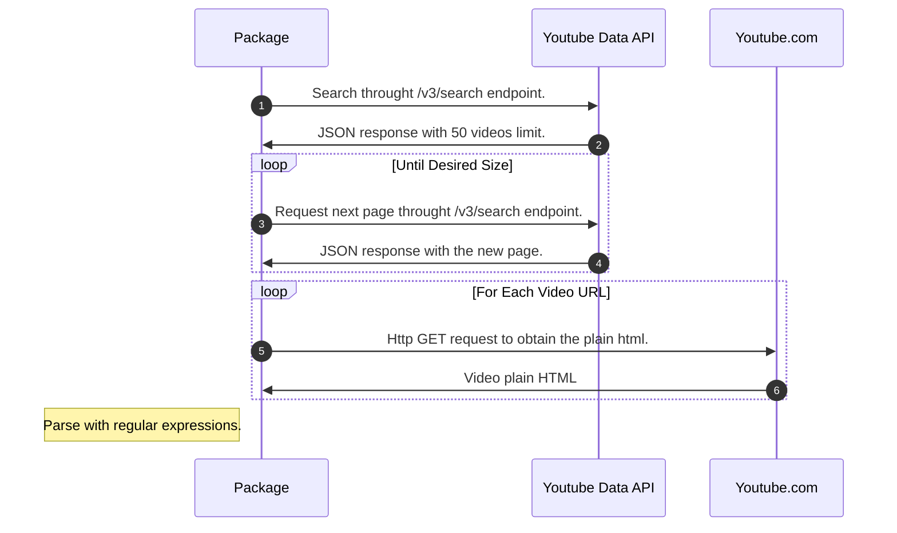
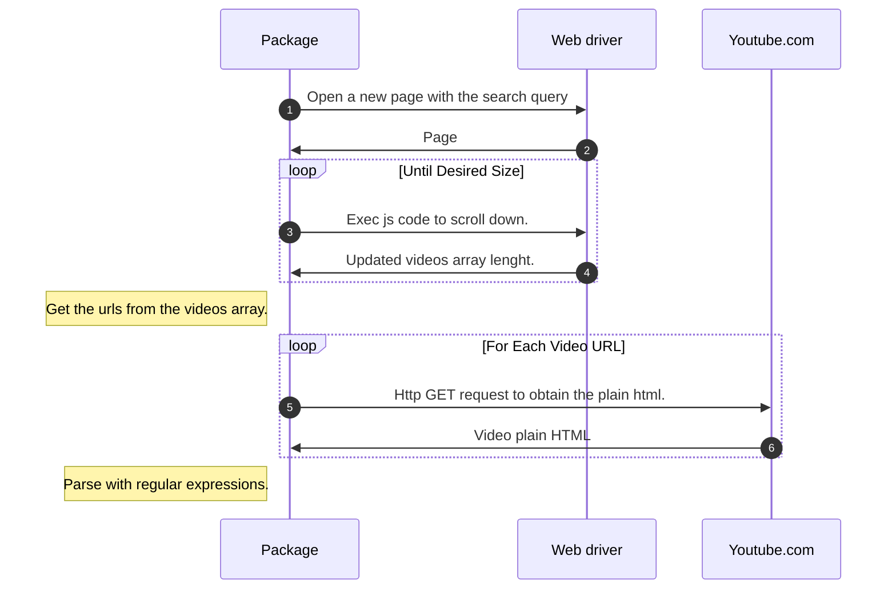

# Youtube scraper

[](https://goreportcard.com/report/github.com/PChaparro/go-youtube-scraper)

**⚠️ Note:** Diagrams are only rendered in github.

With this package you can **get the title, description, url, thumbnail and tags** from youtube videos **using** and **without using** the `Youtube Data API v3`.

**Sample result:**

<p align="center">
  
</p>

## Installation

From your project, run:

```bash
go get github.com/PChaparro/go-youtube-scraper
```

## ✨ Available functions

### Get the `urls` using the youtube API:

The following example will obtain 100 urls for the query "Learn web development" **using** your youtube api key.

```go
urls, err := youtubescraper.GetVideosUrlFromApi("youtube_api_key", "Learn web development", 100)
```

### Get the `urls` without using the youtube API:

The following example will obtain 100 urls for the query "Learn web development" **without using** your youtube api key.

```go
urls, err := youtubescraper.GetVideosUrlFromSite("Learn web development", 100)
```

### Get the `url`, `thumbnail`,`title`,`description`, and `tags` with and without using the youtube API:

The following example will get the data from 100 videos obtained from que search query "Learn web development" **using** your youtube api key (Just to get the urls of each video) and using 32 as concurrent `go routines` limit. **Note the `"youtube_api_key"` and the last boolean argument**

```go
videos, err := youtubescraper.GetVideosData("youtube_api_key", "Learn web development", 100, 32, true)
```

The following example will get the data from 100 videos obtained from que search query "Learn web development" **without using** your youtube api key and using 32 as concurrent `go routines` limit. **Note the empty string used as `youtubeApiKey` argument and the last boolean argument**.

```go
videos, err := youtubescraper.GetVideosData("", "Learn web development", 100, 32, false)
```

## 🔍 Explanation

### How `GetVideosUrlFromApi` function works in `GetVideosData`:



As you saw in the diagram, we only use the **Youtube Data API v3** to request the URLS, that is, **1 time for each 50 videos**.

### How `GetVideosUrlFromSite` function works in `GetVideosData`:



## 🧪 Testing

Take into consideration that running the tests file will use some of your **Youtube Data API V3** Quotas (You can change the test file inside `/tests` folder to use more or less Quotas).

1. Clone this repository

```
git clone https://github.com/PChaparro/go-youtube-scraper
```

2. Create a .env file inside the `/tests` folder with the following field:

```
YOUTUBE_API_KEY=your key here
```

3. Install the testing dependencies:

```
go mod tidy
```

4. Run the tests:

From root directory:

```
go test ./...
```

From tests directory:

```
go test
```
